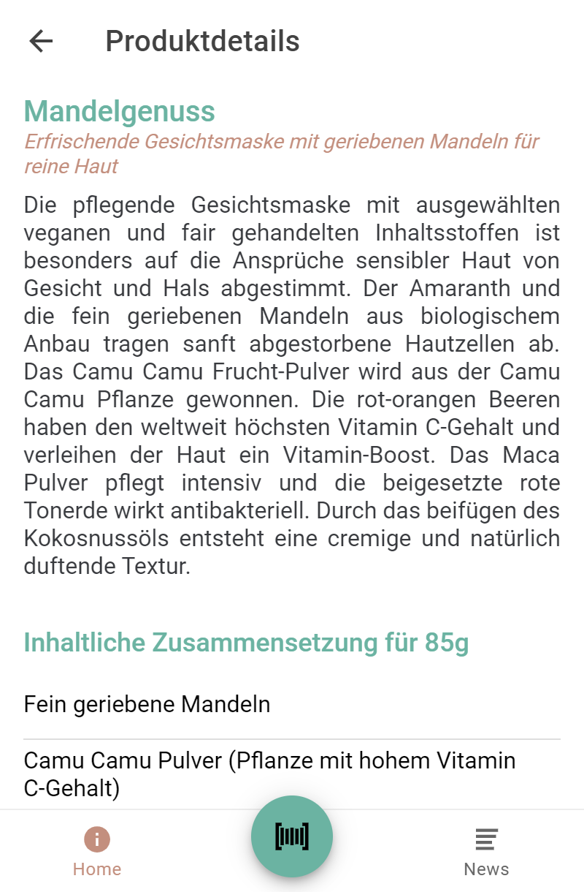
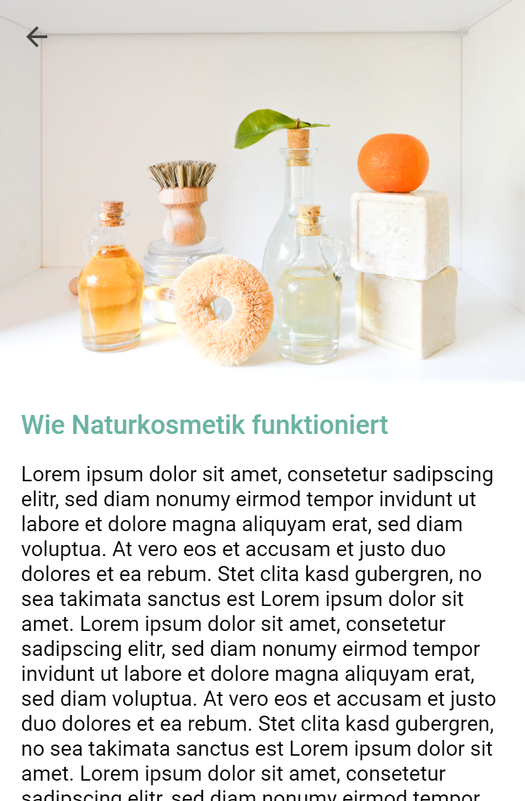

# Karma Kosmetik App

This project shows an app developed for a fictitious startup founded at university during the summer term in 2019. You can find more information on the topic below (only in german).

## Karma Kosmetik: Infos zum Startup

Aufgrund wachsendem Interesse an ökologisch nachhaltigen Produkten, gerade im Bereich
der Konsumgüter, bietet sich ein Projekt an, das dem gesellschaftlichen Interesse nachkommt.
Gerade in den letzten Jahren lassen sich eine verstärkte Nachfrage an Naturkosmetik und
steigenden Umsatzzahlen erkennen.

Um diese Trends zu unterstützen, wird ein Startup gegründet, um naturnahe [DIY](https://de.wikipedia.org/wiki/Do_it_yourself)-Kosmetik herzustellen und zu vertreiben.

### Motivation

Dieses Repository dient zur Entwicklung einer unternehmenseigenen App, die den Kunden von Karma Kosmetik zur Verfügung stehen soll. Das Startup benötigt eine mobile Anwendung, die dabei hilft, die unternehmensinternen Ziele Umsatz und Nachhaltigkeit zu erreichen. Durch aktuelle Nutzerzahlen im Mobile-Bereich wurde festgehalten, dass die mobile Anwendung für Android- und iOS-Geräte zur Verfügung stehen muss. Zudem sollte die Software folgende drei Kernfunktionalitäten bieten:

#### Digitale Produktinformationen

Zum ersten die Bereitstellung von Produktdetails und -anleitungen. Dadurch kann auf gedruckte Produktbeigaben verzichtet werden, was im Sinne der Zielgruppe und des Startups ist. 

#### Punktesystem

Zudem kann man erworbene Produkte mittels QR-Code scannen und dadurch Punkte erhalten, die im zweiten Schritt für verschiedene Boni einglöst werden. Laut der [Global Loyalty-Sentiment Survey](https://www.nielsen.com/de/de/press-releases/2016/three-quarters-of-the-germans-earn-points/) des Marktforschungsunternehmens Nielsen partizipieren 72% der Deutschen in einem Treueprogramm, der EU-Durchschnitt liegt bei 66%. Auch die Nutzerzahl von [30 Mio. Payback-Kunden](https://www.payback.net/ueber-payback/daten-fakten/) belegt dies. Das Punktesystem soll für Umsatzsteigerung und Kundenloyalität sorgen. Letzteres ist auch für das letzte Kernfeature von Vorteil.

#### Vorbild-Funktion des Unternehmens

Durch bereitgestellte News und Artikel soll die App den Kunden für die Themen Kosmetik, Umwelt und Nachhaltigkeit als Anlaufstelle dienen. Dadurch möchte das Startup auch auf diese Themen aufmerksam machen und die Handlungen der Nutzer zum positiven zu verbessern.

## Anforderungserhebung und User Stories

Diese User Stories bieten abgeschlossene Features, die mittels eines agilen Entwicklungsansatzes inkrementell umgesetzt werden.

## Tech-Stack

 
*Arbeitsweise der Frameworks. Quelle: https://code.tutsplus.com/tutorials/ionic-from-scratch-what-is-ionic--cms-29323*

## Showcase

Kurze Demo-Videos sind unter [report/demo](report/demo) zu finden.

| | | |
|:-------------------------:|:-------------------------:|:-------------------------:|
| *Mit Benutzerkonto einloggen*| *Als neuer Nutzer registrieren*| *Home Screen*|
| *Score*| *Belohnungen*| *Verlauf der Punktezahl*|
| *Produkt-Suche*| *Detail-Seite eines Produkts*| *Listen auf der Detail-Seite* |
| *News-Seite mit aktuellen Artikeln*| *Weitere Artikel* | *Ein Artikel von der News-Seite*|

