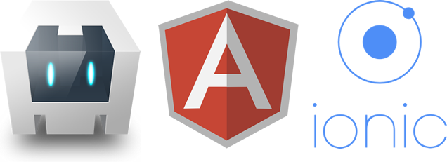
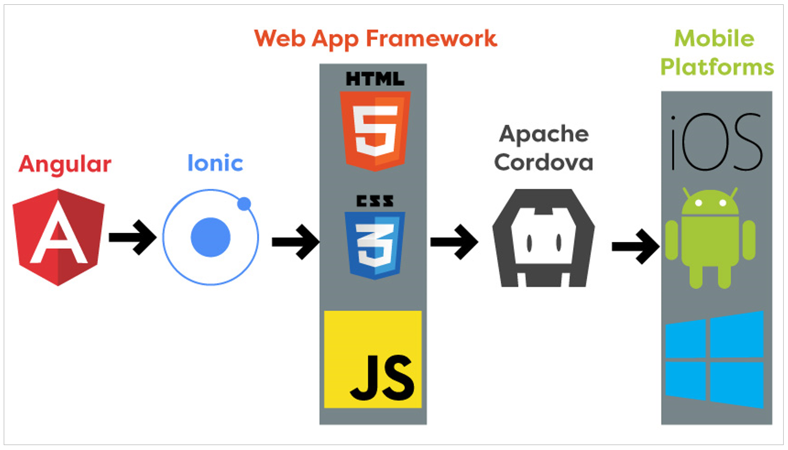

# IP2: Startup DIY-Naturkosmetik

[](https://git.thm.de/bwbr69/ip2-naturkosmetik/commits/master)

Das angelegte Projekt entstand im [2. Integrationsprojekt](https://www.thm.de/organizer/?option=com_thm_organizer&view=subject_details&id=2249). Projektverantwortlicher ist [Herr Ingo Nobbers](https://www.mni.thm.de/fachbereich/dekanat/uebersicht-mitarbeiter/profile/5066-ingo-nobbers).


## Inhaltsverzeichnis

* [Infos zum Startup](#karma-kosmetik-infos-zum-startup)
    * [Motivation](#motivation)
        * [Digitale Produktinformationen](#digitale-produktinformationen)
        * [Punktesystem](#punktesystem)
        * [Vorbild-Funktion des Unternehmens](#vorbild-funktion-des-unternehmens)
* [Vor der Umsetzung](#vor-der-umsetzung)
    * [Anforderungserhebung und User Stories](#anforderungserhebung-und-user-stories)
    * [Auswahl der Technologien](#auswahl-der-technologien)
        * [Das Ionic-Framework](#das-ionic-framework)
        * [Der SaaS-Dienst Firebase](#der-saas-dienst-firebase)
    * [Vorgaben des Unternehmens: Corporate Design](#vorgaben-des-unternehmens-corporate-design)
* [Der Entwicklungsprozess](#der-entwicklungsprozess)
    * [Wireframes, Mockups, Prototypen](#wireframes-mockups-prototypen)
    * [Git](#git)
        * [Git Workflow](#git-workflow)
        * [GitLab CI / CD](#gitlab-ci-cd)
    * [Jetzt bitte die Ärmel hochkrempeln](#jetzt-bitte-die-Ärmel-hochkrempeln)
        * [Herausforderungen](#herausforderungen)
            * [Zwei Ionic-Bugs](#zwei-ionic-bugs)
            * [HideHeaderDirective](#hideheaderdirective)
            * [Timing von Observables](#timing-von-observables)
            * [Warum mehr RAM besser ist als weniger RAM](#warum-mehr-ram-besser-ist-als-weniger-ram)
            * [Karma-Unit-Tests als Pipeline-Job](#karma-unit-tests-als-pipeline-job)
        * [Unit Tests mit Karma und Jasmine](#unit-tests-mit-karma-und-jasmine)
* [Das Ergebnis](#das-ergebnis)
    * [Begeisterungsfaktor: Der Karma Kosmetik Admin](#begeisterungsfaktor-der-karma-kosmetik-admin)
    * [Systemkontext](#systemkontext)
    * [Recap: Was lief gut ...](#recap-was-lief-gut-)
    * [... und was weniger](#-und-was-weniger)
    * [Ausblick](#ausblick)
* [Verzeichnis- und Dateiliste](#verzeichnis-und-dateiliste)
* [Setup-Anleitung](#setup-anleitung)


## Karma Kosmetik: Infos zum Startup

Aufgrund wachsendem Interesse an ökologisch nachhaltigen Produkten, gerade im Bereich
der Konsumgüter, bietet sich ein Projekt an, das dem gesellschaftlichen Interesse nachkommt.
Gerade in den letzten Jahren lassen sich eine verstärkte Nachfrage an Naturkosmetik und
steigenden Umsatzzahlen erkennen.

Um diese Trends zu unterstützen, wird ein Startup gegründet, um naturnahe [DIY](https://de.wikipedia.org/wiki/Do_it_yourself)-Kosmetik herzustellen und zu vertreiben. Das Team besteht aus folgenden Personen, die im fiktiven Unternehmen auch gleichzeitig Gesellschafter sind:


| Gruppenmitglied | Position |
| --- | ---: |
| Tobias Hennies | Controlling |
| Leonie Rau | Marketing |
| Verena Teske | Vertrieb |
| Andreas Vatzolas | Projektmanagement<br>HR |
| Laura Ruth Weber | Management |
| Benedikt Weber | IT-Manger<br>App-Entwickler |

Detaillierte Informationen zum Startup sind auf [Confluence](https://confluence.mni.thm.de/display/SIS2SN/SMS+IP-2+SoSe+2019+Startup+Naturkosmetik+Startseite) verfügbar. Wenden Sie sich für Zugriffsfragen bitte an Herrn Nobbers.


### Motivation

Dieses Repository dient zur Entwicklung einer unternehmenseigenen App, die den Kunden von Karma Kosmetik zur Verfügung stehen soll. Das Startup benötigt eine mobile Anwendung, die dabei hilft, die unternehmensinternen Ziele Umsatz und Nachhaltigkeit zu erreichen. Durch aktuelle Nutzerzahlen im Mobile-Bereich wurde festgehalten, dass die mobile Anwendung für Android- und iOS-Geräte zur Verfügung stehen muss. Zudem sollte die Software folgende drei Kernfunktionalitäten bieten:


#### Digitale Produktinformationen

Zum ersten die Bereitstellung von Produktdetails und -anleitungen. Dadurch kann auf gedruckte Produktbeigaben verzichtet werden, was im Sinne der Zielgruppe und des Startups ist. 


#### Punktesystem

Zudem kann man erworbene Produkte mittels QR-Code scannen und dadurch Punkte erhalten, die im zweiten Schritt für verschiedene Boni einglöst werden. Laut der [Global Loyalty-Sentiment Survey](https://www.nielsen.com/de/de/press-releases/2016/three-quarters-of-the-germans-earn-points/) des Marktforschungsunternehmens Nielsen partizipieren 72% der Deutschen in einem Treueprogramm, der EU-Durchschnitt liegt bei 66%. Auch die Nutzerzahl von [30 Mio. Payback-Kunden](https://www.payback.net/ueber-payback/daten-fakten/) belegt dies. Das Punktesystem soll für Umsatzsteigerung und Kundenloyalität sorgen. Letzteres ist auch für das letzte Kernfeature von Vorteil.


#### Vorbild-Funktion des Unternehmens

Durch bereitgestellte News und Artikel soll die App den Kunden für die Themen Kosmetik, Umwelt und Nachhaltigkeit als Anlaufstelle dienen. Dadurch möchte das Startup auch auf diese Themen aufmerksam machen und die Handlungen der Nutzer zum positiven zu verbessern.


## Vor der Umsetzung


### Anforderungserhebung und User Stories

Bevor die eigentliche Umsetzung der Anwendung beginnt, werden zuallererst Anforderungen in Form von User Stories erhoben. Die Kernfunktionen, die die App besitzen soll, wurden im vorherigen Absatz bereits beschrieben. Die User Stories, die Epics und Personas untergeordnet sind, dienen dazu, abgeschlossene Funktionen herauszuarbeiten, die im agilen Prozess der Softwareentwicklung umgesetzt werden können. Im folgenden sind die User Stories dargestellt:


Diese User Stories bieten abgeschlossene Features, die mittels eines agilen Entwicklungsansatzes inkrementell umgesetzt werden. Dazu werden sie in GitLab Issues überführt, die bei der Entwicklung eine eigene Rolle spielen. Zum Workflow in GitLab später mehr.


### Auswahl der Technologien

Der Wohl für den Fortlauf des Projekts (und zum Teil auch für den Erfolg) wichtigste Schritt ist die Wahl der verwendeten Technoligien. Dabei ist es wichtig, die Anforderungen bei der Auswahl zu berücksichtigen, als auch Faktoren wie die Aktualität, Nutzerzahlen, Wartung beziehungsweise Weiterentwicklung etc. 

Da die Anwendung auf Android- und iOS-Geräten laufen soll, jedoch keine komplexen, system-spezifischen Funktionen bieten muss, bietet sich eine hybride App. Warum? Heutige Web-Technologien sind so weit, dass sie eine native Element mit ihren Elementen imitieren können, ohne UX-Einbußen befürchten zu müssen. Auf der anderen Seite ist nur eine Code Base für mehrere Betriebssysteme nötig, was die Entwicklungszeit bei mehr als einem Ziel-OS stark verkürzt. Die weiteren Vor- und Nachteile von Hybrid-Apps gegenüber nativen möchte ich an dieser Stelle nicht ausführlicher behandeln. Wer sich tiefer damit beschäftigen möchte, dem empfehle ich zum Beispiel [diesen Artikel](https://appsoluts.de/native-apps-vs-hybride-apps-unterschiede-und-vorteile/).

<br>
*Vorteil einer gemeinsamen Code Base. Quelle: Sebastian Süß, Modul [Entwicklung mobiler Applikationen](https://www.thm.de/organizer/?option=com_thm_organizer&view=subject_details&id=33)*


#### Das Ionic-Framework



Die Wahl fiel dabei auf [Ionic](https://ionicframework.com/). Das Framework unterstützt den Entwickler bei der Erstellung einer [PWA (Progressive Web App)](https://de.wikipedia.org/wiki/Progressive_Web_App), die mittels [Apache Cordova](https://cordova.apache.org/) in eine native App portiert werden kann, beispielsweise für Android oder iOS. Die zugrunde liegende Web-Anwendung kann seit Ionic Version 4 wiederum mit verschiedenen Frameworks umgesetzt werden [(vgl. diesen Artikel)](https://ionicframework.com/blog/introducing-ionic-4-ionic-for-everyone/). Ich habe mich in diesem Fall für [Angular](https://angular.io/) entschieden, da Ionic seit Beginn auf Angular aufbaut und mir das Framework bekannt ist, was eine geringere Einarbeitszeit und somit Entwicklungszeit bedeutet. Darüber hinaus verbindet Ionic nicht nur die Schnittstellen der einzelnen Systeme, sondern stellt eigene Web-Components bereit, die das Verhalten und Aussehen von nativen UI-Elementen besitzen und viele Funktionen out-of-the-box liefern.

<br>
*Arbeitsweise der Frameworks. Quelle: https://code.tutsplus.com/tutorials/ionic-from-scratch-what-is-ionic--cms-29323*


#### Der SaaS-Dienst Firebase


Die Ionic-App, die im Frontend angesiedelt ist, kann theoretisch mit jeder HTTP-fähigen API kommunizieren. In Verbindung mit Angular würde sich ein Node.js-Server anbieten, in diesem Fall wird jedoch Firebase eingesetzt. Das SaaS-System von Google ist bis zu einem gewissen Kontingent kostenfrei nutzbar und bietet einige Dienste, die mit einer API nutzbar sind. Über die [Firebase Console](https://console.firebase.google.com/) können relativ schnell Projekte erstellt und eingerichtet werden. Verschiedene Client-Anwendungen können so auf Server-Funktionen zugreifen, ohne ein eigenes Backend zu implementieren. Die Client-Anwendung greift mittels [AngularFire2](https://github.com/angular/angularfire2), einem Wrapper für die Firebase API von Angular, unter anderem auf das Authentizierungssystem, die Datenbank *Cloud Firestore* und den Online-Speicher *Firestorage* zu. 

Hat man in der Fireabse Console alles richtig konfiguriert, ist sogar das Hosten als Web-App möglich. Die App von Karma Kosmetik ist unter [https://ip2-naturkosmetik.web.app](https://ip2-naturkosmetik.web.app) erreichbar, jedoch nur für Mobilgeräte optimiert.

Firebase bündelt dadurch nicht nur eine Sammlung wichtiger Funktionen, die (mehr oder weniger) ohne vorherige Einrichtug nutzbar sind, sondern bietet ebenso eine Realtime-Datenbank, die Änderungen an alle Subscriber in Echtzeit emitted. Dies ist auch unter der Verwendung von Frameworks wie [Express](https://expressjs.com/de/) oder [Socket.io](https://socket.io/) nur schwer nachzubauen. Darüberhinaus ist Firebase je nach Größe der verbunden Anwenund skalierbar, auch die Verknüpfungen mit mehreren Apps stellt dabei kein Problem dar.

<br>
<br>


### Vorgaben des Unternehmens: Corporate Design


<p width="400">Das Corporate Design der App wurde im Team in Form von exakten Hex-Farbwerten und Schriftart festgelegt. Durch die Nutzung von SCSS können Standardwerte wie Schrift und Farben global als Variablen deklariert werden. Zudem gibt es einen [Color Generator](https://ionicframework.com/docs/theming/color-generator).

Die Farben sind mittels entsprechenden Variablen festgelegt.
</p>

<br>
<br>
<br>
<br>
<br>
<br>
<br>


## Der Entwicklungsprozess

Nachdem alle Vorraussetzungen festgelegt wurden, konnte das Projekt aufgesetzt werden. Der Fokus lag dabei auf der korrekten Installation und Einrichtung aller Node-Packages, was vor allem bei mehreren Projekten auf dem selben Entwicklungsrechner nicht immer reibungslos funktioniert. Aber bevor es los geht: Fehlt nicht noch etwas?


### Wireframes, Mockups, Prototypen

Es ist mittlerweile Standard, vor der Software-Entwicklung Wireframes, Mockups und Prototypen zu erstellen. Dadurch bekommen Stakeholder einen ersten Blick auf das Endprodukt, und was viel wichtiger ist: Erste Fehler, beispielsweise in Layout oder Navigation, können frühzeitig entdeckt und so schnell umgangen beziehungsweise behoben werden.

Da ich keine fertig getesteten Prototypen aus dem Medien-Bereich bekommen habe, wurde dieser Punkt nicht in gleicher Weise bearbeitet. Stattdessen habe ich in dem frisch aufgesetzten Projekt schon eine erste Ordnerstruktur mit den wichtigsten IonicPages generiert, und die Templates mit HTML und (S)CSS gefüllt. IonicPages beinhalten ein Angular Module und eine Art Angular Component. Pages werden nicht ineinander angezeigt, wie es mit Components von Angular möglich ist, stattdessen zeigt eine Page immer eine eigene App-Seite an. Dies ist für ein natives Look-and-feel, aber vor allem für die Naviagtion wichtig.

Die Prototypen, die auch in Confluence zu finden sind, liegen [hier](/report/confluence-final-screenshots).

Mit diesen ersten Design-Entwürfen begann somit die Entwicklung der benötigten App und der Umsetzung der zuvor erhobenen Anforderungen mit den festgelegten Tools und Technologien. 


### Git

Die THM hostet unter [git.thm.de](https://git.thm.de) eine eigene GitLab-Instanz, die zur zentralen Code-Verwaltung und Versionierung dient.


#### Git Workflow

> A Git Workflow is a recipe or recommendation for how to use Git to accomplish work in a consistent and productive manner.

So beschreibt Atlassian den Begriff _Git Workflow_ in einem entsprechenden [Tutorial](https://de.atlassian.com/git/tutorials/comparing-workflows). Man versucht also bei der Verwendung von Git sogenannte [*Best Practices*](https://de.wikipedia.org/wiki/Best_practice) einzusetzen, die bereits erprobt und für gut befunden wurden. Dennoch sind einige Workflows nicht besser als andere, sondern schlichtweg an den Einsatzzweck gebunden.

Im Kapitel [User Stories](#anforderungserhebung-und-user-stories) wurde bereits die Verwendung von Issues[^gitlab-issues] in GitLab angedeutet. Diese spielen im Entwicklungsprozess eine zentrale Rolle, denn
im aktuellen Repository kommt der `Feature-Branches`-Workflow zum Einsatz, bei dem für jedes *Feature* ein eigener `branch` erstellt wird. Diese `feature-branches` entstehen immer aus einem eigenen Issue, in dem Informationen, Beschreibungen und ToDo's festgehalten werden. Ist das Feature vollständig und fehlerfrei implementiert, wird ein `merge request`[^gitlab-mr] gestartet, der nach einem erflogreichen Review-Prozess `approved` wird, damit der Code des Features in den `master branch` gemerged wird. Dieser Workflow kann auch zum Beispiel mit dem `Developer-Branches`-Workflow kombiniert werden, was jedoch bei wenigen beziehungsweise einem Enwickler wenig Sinn ergibt.

[^gitlab-issues]: [Issues in GitLab](https://docs.gitlab.com/ee/user/project/issues/)

[^gitlab-mr]: [Merge Requests in GitLab](https://docs.gitlab.com/ee/user/project/merge_requests/)


<br>

<br>
*Quelle: https://t3n.de/news/git-workflows-zusammenarbeit-1095433/git_workflows_feature_branch/*

<br>

#### GitLab CI / CD

`Continuos Ingegration` beziehungsweise `Continous Delivery/Deployment` sind in GitLab integrierte Tools, die eigens definierte Aufgaben in sogenannten `Pipelines` ausführen. So wird in diesem Repository bei jedem Push der Befehl `ionic build --prod` ausgeführt. Kommt es zu Fehlern bei der Ausführung, stoppt die gesamte Pipeline und ein Verantwortlicher wird informiert. Schlägt die Pipeline eines `merge requests` fehl, wird der Code nicht in den `master branch` gemerged. So wird sichergestellt, dass kein fehlerhafter Code im Master landet. Bei jedem Push in den Master (also wenn ein abgeschlossenes Feature fertiggstellt wurde) wird zudem ein `deploy`-Job ausgeführt, der die Web-App auf Firebase hostet. Die Konfiguration der Jobs wird in der [.gitlab-ci.yml](/.gitlab-ci.yml)-Datei vorgenommen. Im nachfolgenden Screenshot sieht man eine beispielhafte Pipeline


Die gesamte Pipeline ist erfolgreich (`passed`), wenn alle Jobs erfolgreich waren. In diesem Fall wurde der Branch `update-readme` in den `master` gemerged, weshalb zuerst der `build`- und danach der `deploy`-Job ausgeführt wurden.

<br>

---

### Jetzt bitte die Ärmel hochkrempeln

Hat man einmal das Projekt angelegt, alle Formalitäten abgehandelt und ein Ziel vor Augen, beginnt die Implementierung der Anforderungen, und alles was drumherum anfällt. Und umso mehr Zeilen Code man produziert, umso mehr Baustellen tun sich auf. Hier ist es enorm wichtig, auf den [Git Workflow](#git-workflow) zu vertrauen und eine Sache nach der anderen abzuarbeiten, sonst entsteht oft nur schwer zu behebendes Chaos!


#### Herausforderungen

Und auch wenn die heutigen Tools und Frameworks den Entwickler in jeglichen Situationen unterstützen, sei es durch Code-Vervollständigung, Prüfung mit [tslint](https://palantir.github.io/tslint/) oder automatisierten `Pipelines`, ergeben sich dennoch Probleme, die vorerst unlösbar scheinen oder die Entwicklung zumindest beeinträchtigen. Dies können sowohl eigens verursachte Bugs sein als auch außenstehende Faktoren, die im schlimmsten Fall nicht beeinflusst werden können. Auf einige der Probleme möchte ich hier kurz eingehen.


##### Zwei Ionic-Bugs

<table>
  <tr>
    <td colspan="2">
        Auch bei einem Framework wie Ionic bleiben Bugs nicht aus, zusätzlich muss enorm viel Zeitaufwand betrieben werden, um alle Schnittstellen zu anderen Modulen aktuell zu halten. 
    </td>
  </tr>
  <tr>
    <td>
        Das erste Problem trat bei dem Befehl <pre>ionic g guard auth</pre> auf und entstand aufgrund eines Updates der Angular CLI. Das dazu erstellte Issue enthält weitergehende Informationen, wurde jedoch noch nicht aktualisiert.        
    </td>
    <td>
        Das zweite Problem manifestierte sich im Fehlen jeglicher Styles einer Suchleiste, das jedoch durch eine schnelle Antwort und durch ein Ionic Update behoben und geschlossen werden konnte.
    </td>
  </tr>
  <tr>
    <td>
        [Generate guard error: 'implements' list cannot be empty](https://github.com/ionic-team/ionic-cli/issues/4058) 
    </td>
    <td>
        [bug: Searchbar styling is totally broken](https://github.com/ionic-team/ionic/issues/18781)
    </td>
  </tr>
</table>

##### HideHeaderDirective

Dass der Header beim Scrollen nach oben verschwindet, ist ein weit verbreitetes Feature, um mehr Platz auf dem Bildschirm zu erhalten und mehr Informationen darzustellen. Die Implementierung dieser Funktion habe ich mir leichter vorgestellt, denn ich musste mich mit nicht funkionierenden oder veralteten Tutorials rumschlagen. Nachdem ich Teilcode in einer funktionierenden Directive zusammengetragen hatte, erstellte ich ein Q&A auf Stackoverflow, das [hier](https://stackoverflow.com/questions/56996294/how-to-hide-header-on-scroll-in-ionic-4/56996295#56996295) zu finden ist.


##### Timing von Observables

Observables bieten sehr mächtige Funktionen, und nach jedem Projekt habe ich etwas Neues über die `rxjs`-Bibliothek gelernt. In diesem saß ich Stunden an einer Subscription, die weder den Success- noch den Error-Fall ausführte. Long story short: Observables emitten ihren Wert an alle Subscriber. Wer jedoch subscribed, nachdem ein Wert emittet wurde, bekommt `null` zurück und die `subscribe`-Funktion wird nicht ausgeführt. Die Lösung dafür war ein `ReplaySubject`, das neuen Subscribern den zuletzt emitteten Wert zur Verfügung stellt. 

[Zum StackOverflow-Post](https://stackoverflow.com/questions/56908909/ionic-4-subscribe-only-fires-when-page-is-loaded-directly/56925383#56925383)


##### Gibt es überhaupt diesen Klimawandel?

Die Ende Juni beginnende Hitzewelle setzte nicht nur mir als Entwickler, sondern auch meinem Rechner (der nicht besonders gut gekühlt ist) zu. Resultat: Bei jedem `npm install` oder dem Indexing von Webstorm gleichte der Lautstärkepegel einem Flugzeugtriebwerk, und die Arbeit musste zwingend für 5 Minuten unterbrochen werden. Nicht sehr hilfreich, wenn man gerade in einem Problem vertieft ist.


##### Warum mehr RAM besser ist als weniger RAM

Bis jetzt kam ich mit 8 GB noch an jedes (Entwicklungs-) Ziel, doch damit hatte ich die Rechnung ohne den Android Emulator gemacht. Da das Debugging auf meinen Android-Smartphone nicht funktionierte, blieb mir beispielsweise für das Testen des Barcode-Scanners nur der Emulator (der aus Android Studio heraus gestartet werden musste), was meinem Laptop zeitweise das Ende bereitete. An ausführliche Tests brauchte ich gar nicht erst denken, dafür musste ich jedes mal die `.apk` erzeugen und auf meinem Smartphone installieren. Hier zwei Screenshots, die das Problem kurz festgehalten haben:


    


##### Karma-Unit-Tests als Pipeline-Job

Oder: _Warum es fast einfacher ist, die gesamte App direkt in Maschinencode zu schreiben_. Ich hatte gerade mal alle von Angular erstellten Test-Dateien (`*.spec.ts`) so bearbeitet, dass kein Test mehr fehlschlug, als ich an einen eigen Job für Unit Tests dachte, sind doch die drei allgegenwärtigen Beispiele für Git-Pipelines `build`, `test`, und `deploy`. Hätte ich zu diesem Zeitpunkt mein jetziges Wissen gehabt, hätte ich die Zeit sinnvoller verwendet. So bleibt mir nur, meine Versuche in folgendem Chart darzustellen, das erfolgreiche (grün) und fehlgeschlagene (grau) Pipelines zeigt:


Bei rund [1,4 Mio. Angular-Nutzern (Stand Juni 2018)](https://www.heise.de/developer/meldung/Angular-Connect-Verbreitung-Community-und-Zukunft-des-Frameworks-4212790.html#nav_derzeiti__0) bin ich davon ausgegangen, dass es eine einfach Lösung geben muss. Nach endlosem Durchforsten von Github- und StackOverflow-Posts konnte ich das Problem auf folgendes eingrenzen: Karma benötigt für die Tests einen Browser, standardmäßg Chrome. Dies ist jedoch bei einem Pipeline-Job schwierig, da dieser in einem eigenen Docker-Container[^Docker] läuft. Die [trion development GmbH](https://www.trion.de/) hat dafür das Docker-Image [trion/ng-cli-karma](https://hub.docker.com/r/trion/ng-cli-karma/) veröffentlicht. Leider wurde meine Anfrage zum Whitelisting des Images nicht stattgegeben, da der Verwaltungsaufwand (verständlicherweise) zu hoch wird. Dadurch blieb mir nur die Regisitrierung eines `Specific Runners` auf meinem lokalen Entwicklungsrechner, der das benötigte Image ausführte. Da mein Laptop lediglich eine bescheidene WLAN-Verbindung besitzt, [stieg die Laufzeit der einzelnen Pipelines auf das bis zu drei-fache](report/assets/problems/test-pipeline/commit-duration.png). Es kam auch nicht selten vor, dass das Pullen des Docker-Images [fehlschlug](report/assets/problems/test-pipeline/docker-image-pull-fails.png) oder die Installation der `node_modules` die [maximale Laufzeit des Jobs erreichte](report/assets/problems/test-pipeline/npm-install-timeout.png). 

[^Docker]: Mehr Infos zu Docker: [https://entwickler.de/online/windowsdeveloper/docker-grundlagen-dotnet-container-579859289.html](https://entwickler.de/online/windowsdeveloper/docker-grundlagen-dotnet-container-579859289.html)


#### Unit Tests mit Karma und Jasmine

Nach dem fehlgeschlagenen Versuch der Test-Pipeline hatte ich zuerst keine so richtige Lust mehr auf das Testen, zumal ich mich noch nie damit auseinandergesetzt hatte. Ich las und schaute dennoch einige Tutorials, die mich schließlich auf den Geschmack brachten. Das Gefühl der Nachricht `test passed` kommt direkt nach `build successful` ;-).

Aus Zeit- und Ressourcengründen habe ich die Unit-Tests mit Karma und Jasmine auf den News-Bereich der Anwendung beschränkt. Dies beinhaltet die `NewsPage`, die alle verfügbaren Artikel auflistet und eine Suche bereitstellt, die `NewsDetailPage`, die einen entsprechenden Artikel auf einer eigenen Seite zum lesen darstellt, und den `NewsService`, der für die Kommunikation mit der Datenbank verantwortlich ist. Durch die asynchronen Datenabrufe waren die Tests zuerst etwas kompliziert, doch mit den richtigen Tools und Funktionen bekommt man alle Tests wie gewünscht implementiert. Ein wichtiger Punkt, den ich zuerst nicht beachtete, ist die Isolation von den zu testenden Objekten. So habe ich eine Mock-Klasse für den `NewsService` geschrieben, der die Funktionalität biespielhaft nachbildet. Im folgenden ein Code-Beispiel:

`news.service.ts`
```typescript

@Injectable({
    providedIn: 'root'
})
export class NewsService {

    news = new ReplaySubject<Article[]>(2);

    /*
     * Delay news to show loading animation
     */
    newsDelayed = this.news.pipe(delay(1500));

    constructor(private afStore: AngularFirestore) {
        this.getArticles().subscribe((a) => {
            this.news.next(a);
        });
    }

    private getArticles(): Observable<Article[]> {
        return this.afStore.collection<Article>('news').valueChanges();
    }

    getArticleById(id: string): Observable<Article> {
        return this.afStore
            .collection<Article>('news')
            .doc<Article>(id)
            .valueChanges();
    }

}

```

`news-service.mock.ts`
```typescript
export class NewsServiceMock {
    
    news = new ReplaySubject<Article[]>(2);
    
    newsDelayed = this.news.pipe(delay(1500));

    constructor() {
        this.getArticles().subscribe((a) => {
            this.news.next(a);
        });
    }

    private getArticles(): Observable<Article[]> {
        // return array including one example article
        return of([exampleArticle]);
    }

    getArticleById(id: string): Observable<Article> {
        // return example article
        return of(exampleArticle);
    }

}
```

Die Mock-Klasse muss dabei alle Felder und Methoden mit den passenden Datentypen implemtieren. Als Antwort wurde jeweils ein Beispiel-Artikel verwendet. Die Dateien mit allen Tests sind hier zu finden:

<table>
    <tr>
        <td>
            [news.service.ts](src/app/shared/services/news.service.ts)
        </td>
        <td>
            [news.service.spec.ts](src/app/shared/services/news.service.spec.ts)
        </td>
    </tr>
    <tr>
        <td>
            [news.page.ts](src/app/news/news.page.ts)
        </td>
        <td>
            [news.page.spec.ts](src/app/news/news.page.spec.ts)
        </td>
    </tr>
    <tr>
        <td>
            [news-detail.page.ts](src/app/news/news-detail.page.ts)
        </td>
        <td>
            [news-detail.page.spec.ts](src/app/news/news-detail.page.spec.ts)
        </td>
    </tr>
</table>


Bei jedem Test-Fall (außer den `should create`-Tests) sind ID's angegeben. Die einzelnen Testfälle sind nach einer Vorlage hier dokumentiert: [tests-news.md](report/tests/tests-news.md).


## Das Ergebnis

Nach wochenlangen Meetings und mehr als 4000 Zeilen Code[^loc] sind die Hauptfeatures und die durch User Stories ausgearbeitete Anforderungen fertig. Hier ein kurzes Recap der implementierten Funktionalitäten:

1. Möglichkeit zum Registrieren und Einloggen mit FirebaseAuthentication
2. Produktsuche und die Darstellung von Informationen und Anleitungen
3. Punktesystem: 
    - Scannen eines QR-Codes als Produktbeigabe und Gutschrift von Punkten
    - Ein QR-Code kann nur einmal gescannt werden, um Unternehmensverluste durch Missbrauch zu verhindern
    - Wird der Code nicht mit der offiziellen Karma Kosmetik App gescannt, wird der Nutzer auf eine eigens dafür vorbereite Landing Page weitergeleitet. Dort wird er aufgefordert, die Karma Kosmetik App zu installieren, um Punkte für das Produkt zu erhalten 
    - Einlösen der Produkte für verschiedene Boni
4. Möglichkeit zum auszuloggen (Die Funktion zum Löschen des eigenen Kontos ist im Template vorbereitet)
5. Anzeigen von News und Artikeln in eigenem App-Bereich


[^loc]: Summiert wurden alle Zeilen aus allen TypeScript-Dateien, die unter `/src/app` liegen, also der Kern der Anwendung. Generierter Code ist inkludiert. [Mehr Infos](/report/lines-of-code.md)


Da ich meine Anwendung vor der Abgabe nicht mehr demonstriert habe, finden sich im Folgenden einige Ausschnitte. 

_**Anmerkung:** Die schlechte Performance wird dabei durch das Screen-Recorder Programm verursacht._

Hier ein beispielhafter QR-Code, wie er als Beigabe zu einem Produkt zu finden ist:


<br>

*Intro Slides, die kurz die Funktionen der App darstellen, und die Form Validierung beim Registrieren:*


*Die grundlegenden Funktionen in der App bis auf Scannen des Codes (im Browser aufgezeichnet):*


*Das Scannen eines Produkt-Codes und die Gutschrift der Punkte:*


*Das Scannen eines Produkt-Codes mit einem allgemeinen Barcode-Scanner:*


*Aus seinem Benutzerkonto ausloggen:*


<br>

### Begeisterungsfaktor: Der Karma Kosmetik Admin

Um den Mitarbeitern von Karma Kosmetik eine einfache Möglichtkeit zu bieten, die App-Inhalte zu verwalten, wurde eine Administrationsoberfläche in [diesem Repository](https://git.thm.de/bwbr69/ip2-naturkosmetik-admin) umgesetzt. Dabei wurde ein schlichtes Angular-Projekt aufgesetzt, dass mit der Datenbank kommuniziert und den Mitarbeitern folgende Möglichkeiten bietet:

1. Produktinformationen bearbeiten<br>
   *Hier* können alle Daten verändert werden, zum Beispiel der Preis oder die Zutaten-Liste
2. Produkte "produzieren"<br>
   *Diese Funktion erzeugt eine Chargen- und darunter die festgelegte Anzahl von Seriennummern in der Datenbank. Mittels der* Scanova-API[^Scanova] *wird für jede erstellte Seriennummer ein QR-Code generiert und in Firestore hochgeladen. Eine spätere Anbindung zum ERP-System ist möglich, um den Prooduktionsprozess zu automatisieren.*
3. Boni erstellen und bearbeiten
3. Artikel erstellen und bearbeiten

Die Funktionen sind ebenfalls in den folgenden Demo-Videos aufgezeichnet:

<br>

*Produktinformationen bearbeiten:*


*Bonus erstellen:*


*"Produzieren":*

   
   
[^Scanova]: [https://api.scanova.io/](https://api.scanova.io/)


### Systemkontext

Ich möchte hier nocheinmal kurz den Systemkontext mit allen verwendeten Tools einfügen. Dieser ist absichtlich ans Ende gestellt, da die einzelnen Komponenten und Anwendungen erst nacheinander erklärt werden.


### Recap: Was lief gut ...

An diesem Punkt muss ich besonders die Gruppendynamik hervorheben. Durch die professionelle Handhabung des Projekts konnten wir viel erreichen. Die donnerstags stattfindenden, ausführlichen Meetings beinhalteten stest die bearbeiteten Aufgaben und die Verteilung von Neuen. Da wir eine Woche zwischen den Terminen als zu lang empfunden, führten wir ein kurzes Skype-Meeting am Montag ein, das ab ca. der Hälfte durch die Anwesenheitspflicht dienstags bei Herrn Nobbers abgelöst wurde. Dadurch verlor man keine Aufgaben aus den Augen und konnte schnell Gruppenfeedback erhalten.

Einige der aufgetretenen Probleme habe ich bereits dargestellt, davon abgesehen Verlief die Umsetzung durch die Verwendung von aktuellen Frameworks mit großer Nutzerzahl relativ stressfrei, da sich für viele Probleme Lösungen im Internet finden.

Desweiteren empfand ich die Aufsicht von Herrn Kneisel als sehr angenehm. Obwohl ich nicht immer an den Vertiefungsseminar/IP2-Meetings teilnehmen konnte, wurden mir Fragen immer beantwortet, zur Umsetzung des Projekts jedoch genügend Freiraum gelassen, womit ich auch zum nächsten Punkt kommen möchte.


### ... und was weniger

Ich weiß, dass die Organisation eines solchen (säulenübergreifenden) Projekts nicht einfach ist, und auch Sie (die Säulenverantwortlichen) viel Zeit in die Planung gesteckt haben. Desweiteren weiß ich auch, dass Studenten oft einen Elefanten aus Mücken machen, und sich (auch Fehl-) Informationen schnell rumsprechen. Dennoch belegt man mit dem [GEN1001 Integrationsprojekt (Vertiefungsseminar)](https://www.thm.de/organizer/?option=com_thm_organizer&view=subject_details&id=2249) ein Modul, dass einen gewissen Zeitaufwand vorgibt und dem Studierenden 6 Credits einbringt. Damit man auch als Student/-in das Gefühl hat, den Anforderungen gerecht zu werden und das Modul mit einer für sich akzeptablen Note abzuschließen, ist die Kundgabe einiger Rahmeninformationen unerlässlich. Diese fehlten vor allem am Anfang des Semesters, was den Beginn der Projektarbeit herauszögerte. Vor allem durch die verteilten Slots von Management, Medien und IT und teils sich widersprechenden Informationen der Betreuer kamen zuanfangs ebenfalls einige Missverständnisse auf, die durch einen einheitlichen Informationsfluss hätten vermieden werden können.

Ein weiteres Problem waren die Deadlines, die, nicht wie angenommen, 2-3 Tage vor dem Presentation Day lagen, sondern mit dem 14. Juli ganze 12 Tage vorher. Diese Information kam jedoch erst gut 2 Wochen vorher, was in der letzten Studienwoche, in der der Arbeitsaufwand in allen Modulen am höchsten ist, unnötig viel Stress erzeugte. Dank des [Parkinsonschen Gesetzes](https://de.wikipedia.org/wiki/Parkinsonsche_Gesetze#Parkinsonsche_Gesetze) habe ich jedoch glücklicherweise alles fertiggestellt ;-)

Trotz alledem habe ich im gesamten Projekt viel gelernt und ebenso viel Spaß gehabt, und weiß auch, dass solche Probleme im Nachhinein in Vergessenheit geraten. Im nachhinein erinnert man sich nur noch an das (hoffentlich erfolgreiche) Projekt, nehmen Sie also die zwei vorangegangenen Absätze als konstruktive Kritik für die kommenden Semester.


### Ausblick

An dieser Stelle bleibt mir nur noch eine kurze Aussicht auf den Fortbestand und die Weiterentwicklung der Anwendung. Es sind noch einige (optionale) Issues offen, die vorbereitet sind und in kurzer Zeit umgesetzt werden können. Darunter zählen zum Beispiel die Implementierung des *Social Login*, der den Anwendern nicht nur die Registrierung per Email anbietet, sondern auch das Einloggen mit vorhandenen Social-Media Accounts. Ebenso ist ein Link zur Wiederherstellung des Passworts sehr hilfreich. Desweiteren müssen die Unit Tests für eine hundertprozentige Code-Coverage[^codeCoverage] ausgebaut werden. Dank der Initialisierung von Test-Dateien bei der Erstellung mit der `CLI` von Ionic oder Angular kann mit der Erstellung von Test-Fällen direkt begonnen werden. Alle benötigten Tools und Abhängigkeiten sind bereits eingerichtet. Darauffolgend können End-to-End-Tests mit Protractor aufgesetzt werden.

Mit Firebase wurde ein skalierbares Backend gewählt, dass auch mit hohen Zugriffen einfach zurechtkommt. Der Verbreitung der App steht damit schon einmal nichts im Weg!

Ebenfalls wäre eine Gefällt-mir-Funktion bei Artikeln wünschenswert, genau wie die Möglichkeit zum Kommentieren. Auch diese Funktionen können durch die Live-Datenbank ohne größere Probleme umgesetzt werden.

Einige Bugs werden unvermeidbar während dem produktiven Einsatz auftreten. Hier ist es wichtig, die App erst im bekannten Umfeld zu launchen und Feedback einzuholen. Ebenfalls ist ein transparenter Umgang mit Kundenfeedback von Vorteil, um eine reibungslos funktionierende Anwendung zu gewährleisten.

Wenn der Vertrieb der Produkte von Karma Kosmetik anläuft, bleibt nur noch die Erstellung der Installationsdateien für Android und iOS und der Launch in den jeweiligen Stores!

<br>

---

<br>


Mit diesen Worten endet nun mein Projektbericht, der ein paar Einblicke in die Entwicklung und meine Arbeit der letzten Wochen gewährt. Ich hoffe Sie hatten (wenigstens ein wenig) Spaß beim Lesen!

*Benedikt Weber*


<br>

<br>


## Verzeichnis- und Dateiliste

Ionic erstellt bei einem initialen Projekt bereits eine geeignete Projektstruktur, die mit Angular vereinbar ist. 

 Ordner | Beschreibung
 --- | ---
.firebase [lokal] | Interner Ordner für Firebase Hosting
commands | Enthält eigens geschriebene Batch-Dateien mit häufig genutzten Befehlen
e2e | Ein interner Ordner für [End-to-end Testing](https://angular.io/cli/e2e)
node_modules [lokal] | Speicherort für externe Pakete, die mittels `npm` installiert wurden
platforms [lokal] | Wird von Ionic zum erstellen der nativen Apps benötigt
plugins [lokal] | Pfad für Cordova[^cordova-plugins] Plugins, die für den Zugriff auf gerätespezifische Funktionen benötigt werden
report | Hier sind alle zusätlichen Dateien wie Schaubilder oder Demo-Videos für den Projekt-Bericht abgelegt
resources | Ressourcen für native Apps, siehe [resources/README.md](resources/README.md)
src | Der wichtigste Ordner des Projekts, er enthält den eigens erstellten Code
www [lokal] | Enthält die den fertigen Build der PWA

<br>

`/src`

Ordner / Datei | Beschreibung
 --- | ---
 app | Hier sind alle Pages, Components, Modules, Services, Directives ... abgelegt, die zur Erstellung der PWA benötigt werden
 assets | Enthält Dateien für die Anwendung selbst, wie beispielsweise interne Bilder oder das Logo
 environments | Hier liegen lediglich die Dateien `environment.ts` und `environment.prod.ts`. Sie behinhalten globale Konfigurationen wie Beispielsweise den API-Key von Firebase oder Scanova
 mocks | Enthält Mock-Klassen für [Unit-Tests](#unit-tests-mit-karma-und-jasmine)
 theme/variables.scss | Beinhaltet globale Ionic-Variablen, beispielsweise für [Farbgebung](#vorgaben-des-unternehmens-corporate-design)
 global.scss | Eine Datei für eigene globale CSS-Style-Angaben
 index.html | Die index-Datei, die später im Browser angezeigt wird
 karma.conf.js | Die Konfigurationsdatei für [Karma](#unit-tests-mit-karma-und-jasmine)
 ... alle weiteren | Sind Konfigurationsdateien von Angular und Ionic
 
 <br>
 
 `/src/app`
 
 Die einzelnen Pages entstehen aus 4 Dateien: Einer `module.ts` für die Modul-Deklarationen, einer `.html` für das Template, einer `.scss` für Styles, einer `.spec.ts` für Unit Tests und einer `page.ts` für die Logik der Seite.
 
 Ordner / Datei | Beschreibung
  --- | ---
 auth | Beinhaltet die LoginPage und die RegisterPage
 home | Enhält die HomePage und alle SubPages davon, die als EntryPoint in die App gehandelt wird und die Produktsuche enthält
 home/history | Zeigt die vergangenen Transaktionen in einer Page
 home/product-detail | Zeigt Informationen und Anleitungen zu den Produkten
 home/profile | Hier kann sich der User ausloggen und sein Konto löschen
 home/score | Zeigt den Punktestand und verfügbare Boni an
 intro | Dies ist die Page für die erklärenden IntroSlides beim ersten Starten der App
 news | Zeigt eine Liste verfügbarer Artikel
 news/news-detail | Zeigt einen entsprechenden Artikel
 qr-landing | Zeigt die Landing-Page, wenn ein QR-Code nicht mit der offiziellen App gescannt wird
 shared | Ordner für Directives, Guards, Models, Pipes, Services und Validators. Diese Komponenten werden in der gesamten App wiederverwendet und befinden sich daher in einem eigenen Shared-Ordner. Für die Nutzung der Direktive ist ein SharedModule[^shared-module] eingebunden.
 

[^cordova-plugins]: [https://git.thm.de/bwbr69/ip2-naturkosmetik](https://git.thm.de/bwbr69/ip2-naturkosmetik)

[^shared-module]: [https://angular.io/guide/sharing-ngmodules](https://angular.io/guide/sharing-ngmodules)


## Setup-Anleitung

_**Anmerkung:** Da man das Rat nicht neu zu erfinden braucht, ist dieser Abschnitt bewusst kurz gehalten und mit Verweisen auf die jeweiligen Anleitungen versehen._

Für die Ausführung der Anwendung wird Ionic benötigt, bitte folgen Sie [dieser Anleitung](https://ionicframework.com/docs/installation/cli).

Nachdem das Projekt gepullt wurde, kann ein Development-Server mittels `ionic serve` gestartet werden, der die Anwendung im Browser zeigt. Für das Veröffentlichen der Anwendungen für Android und iOS folgen Sie bitte [dieser Anleitung](https://ionicframework.com/docs/v3/intro/deploying/).

Die Firebase Console ist [hier](https://console.firebase.google.com/project/ip2-naturkosmetik/overview) zu finden, Sie benötigen jedoch zuerst Zugriffsrechte.

<br>


## Fußnoten
